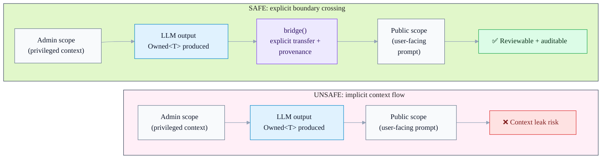

<div align="center">
  <picture>
    <source media="(prefers-color-scheme: dark)" srcset="./.github/images/logo-dark.png" />
    
  </picture>

  <h1>Mullion</h1>

  <p><strong>Type-safe LLM context management for TypeScript</strong></p>
  <p>Catch context leaks, enforce trust boundaries, and make LLM outputs auditable — before runtime.</p>

  <p>
    <a href="./LICENSE"></a>
    
    
  </p>
</div>

---

## What is Mullion?

**Mullion is a safety + correctness layer for LLM workflows in TypeScript.**  
Not an orchestration engine. Not a graph runner. Think: **ESLint + TypeScript guardrails for LLM code**.

It helps teams build production AI features where:

- **Sensitive data** (admin/PII/secrets) must not “accidentally” reach public prompts
- LLM outputs are treated as **probabilistic**, not deterministic JSON
- You want **compile-time boundaries** + **static analysis** instead of runtime heroics
- You need **auditability**: “where did this output come from?” / “what crossed which boundary?”

**Keywords (SEO):** TypeScript LLM, AI safety, context leak prevention, trust boundaries, prompt safety, LLM provenance, ESLint rules for AI, Vercel AI SDK integration.

---

## The problem: context leaks (the #1 architectural footgun)

When “context” is just strings/objects, it tends to leak across trust boundaries:

```ts
// ❌ DANGEROUS: privileged data can reach a public response path
const adminNotes = await adminCtx.infer(NotesSchema, internalDoc);
await publicCtx.respond(adminNotes.value); // leak risk
```

With Mullion, boundary crossing becomes explicit and traceable:

```ts
// ✅ SAFE: explicit boundary crossing with provenance
const adminNotes = await adminCtx.infer(NotesSchema, internalDoc);

await client.scope('public', async (ctx) => {
  const safe = ctx.bridge(adminNotes);
  return ctx.respond(safe.value);
});
```

## Dataflow at a glance (unsafe vs safe)



---

## Quick start

Mullion is modular — this root README is about the **whole repo**. Each package will have its own README.

> **Pre-release:** packages are not published to npm yet.  
> You can run the examples from this repo and consume workspace packages locally.

### Install (from source)

```bash
pnpm install
pnpm build
```

Then explore:

- `examples/basic`
- `EXAMPLES.md`
- `docs/README.md`

---

## Why Mullion (in one screen)

- **Prevent context leaks by design** (explicit boundary crossing)
- **Type-safe LLM outputs** (`Owned<T>`, confidence, provenance)
- **Static analysis for AI code** (ESLint rules that understand scopes/ownership)
- **Auditability built in** (trace IDs + explicit bridging)
- **Built for modern TS stacks** (works great with Vercel AI SDK)

---

## Mullion vs. raw AI SDK

Vercel AI SDK (`ai`) is great for **model calls**. Mullion adds **guardrails for dataflow**:

- **Raw AI SDK:** prompts/outputs are just values → trust boundaries are implicit.
- **Mullion:** scopes + `Owned<T>` make boundaries explicit and reviewable.
- **Raw AI SDK:** easy to accidentally mix privileged and public context.
- **Mullion:** boundary crossing requires `bridge()` (lintable + auditable).
- **Raw AI SDK:** output reliability is a convention.
- **Mullion:** confidence/provenance are part of the contract (`traceId`, policies).

**Mullion is designed to complement — not replace — AI SDK.**

---

## Use cases

Mullion shines anywhere you have **multiple trust zones** and want **TypeScript-level safety** for LLM dataflow:

- **Multi-tenant SaaS / copilots:** prevent cross-tenant context leaks, enforce per-tenant boundaries.
- **Admin tooling + public UI:** keep privileged/admin context from influencing user-facing prompts by accident.
- **RAG over sensitive docs:** control what retrieved chunks can cross into public scopes; keep provenance for audits.
- **Compliance-heavy domains (fin/health/legal):** auditable provenance, explicit boundary crossing, policy enforcement.
- **High-scale LLM ops:** cache-aware execution patterns, cost visibility hooks, fewer accidental regressions.

See: `docs/guides/use-cases.md`

---

## Packages

| Package                  | What it is                                                            | Use it when                |
| ------------------------ | --------------------------------------------------------------------- | -------------------------- |
| `@mullion/core`          | Fundamental primitives: scopes, `Owned<T>`, bridging, merge utilities | Always                     |
| `@mullion/ai-sdk`        | Adapter layer for Vercel AI SDK (`ai`)                                | If you use Vercel AI SDK   |
| `@mullion/eslint-plugin` | Static rules to prevent leaks + enforce safe patterns                 | Recommended for teams & CI |

---

## Documentation

- Docs index: `docs/README.md`
- Guides: `docs/guides/`
- Reference: `docs/reference/`
- Design notes: `docs/design/`
- ADRs: `docs/adr/`

Examples:

- `examples/basic`
- `EXAMPLES.md`

Roadmap:

- `TODO.md`

---

## Current status

Mullion is under active development. Expect API refinements while we harden:

- correctness + ergonomics
- lint rules & developer experience
- provider-facing integration surfaces
- cost/observability features

For the definitive plan and progress, see `TODO.md`.

---

## Contributing

- Integration testing guide (contributors): `docs/contributing/integration-tests.md`

```bash
pnpm install
pnpm build
pnpm typecheck
pnpm test
```

This repo uses pnpm workspaces + turborepo + changesets.  
See `AGENTS.md` / `CLAUDE.md` for workflow notes.

---

<div align="center">
  <p>Built by Mullion Labs — safety-first LLM engineering for TypeScript.</p>
</div>
