<div align="center">
  <picture>
    <source media="(prefers-color-scheme: dark)" srcset="./.github/images/logo-dark.png" />
    
  </picture>

  <h1>Mullion</h1>

  <p><strong>Type-safe LLM context management for TypeScript</strong></p>
  <p>Catch context leaks, enforce trust boundaries, and make LLM outputs auditable — before runtime.</p>

  <p>
    <a href="https://www.npmjs.com/package/@mullion/core"></a>
    <a href="https://www.npmjs.com/package/@mullion/core"></a>
    <a href="https://github.com/mullionlabs/mullion-ts/actions/workflows/ci.yml"></a>
    <a href="./LICENSE"></a>
    
  </p>
</div>

---

## What is Mullion?

**Mullion is a safety + correctness layer for LLM workflows in TypeScript.**  
Not an orchestration engine. Not a graph runner. Think: **ESLint + TypeScript guardrails for LLM code**.

It helps teams build production AI features where:

- **Sensitive data** (admin/PII/secrets) must not “accidentally” reach public prompts
- LLM outputs are treated as **probabilistic**, not deterministic JSON
- You want **compile-time boundaries** + **static analysis** instead of runtime heroics
- You need **auditability**: “where did this output come from?” / “what crossed which boundary?”

**Keywords (SEO):** TypeScript LLM, AI safety, context leak prevention, trust boundaries, prompt safety, LLM provenance, ESLint rules for AI, Vercel AI SDK integration.

---

## The problem: context leaks (the #1 architectural footgun)

When “context” is just strings/objects, it tends to leak across trust boundaries:

```ts
// ❌ DANGEROUS: privileged data can reach a public response path
const adminNotes = await adminCtx.infer(NotesSchema, internalDoc);
await publicCtx.respond(adminNotes.value); // leak risk
```

With Mullion, boundary crossing becomes explicit and traceable:

```ts
// ✅ SAFE: explicit boundary crossing with provenance
const adminNotes = await adminCtx.infer(NotesSchema, internalDoc);

await client.scope('public', async (ctx) => {
  const safe = ctx.bridge(adminNotes);
  return ctx.respond(safe.value);
});
```

## Dataflow at a glance (unsafe vs safe)

```mermaid
%%{init: {
  "theme": "base",
  "themeVariables": {
    "fontFamily": "ui-sans-serif, system-ui, -apple-system, Segoe UI, Roboto, Arial",
    "lineColor": "#94a3b8",
    "textColor": "#0f172a"
  }
}}%%

flowchart LR
%% ========== NODE STYLES (solid fills) ==========
    classDef admin  fill:#f8fafc,stroke:#64748b,color:#0f172a;
    classDef llm    fill:#e0f2fe,stroke:#0284c7,color:#0f172a;
    classDef public fill:#f8fafc,stroke:#64748b,color:#0f172a;

    classDef bridge fill:#ede9fe,stroke:#7c3aed,color:#2e1065;
    classDef ok     fill:#dcfce7,stroke:#16a34a,color:#052e16;
    classDef danger fill:#fee2e2,stroke:#dc2626,color:#7f1d1d;

%% ========== SAFE ==========
    subgraph S["SAFE"]
        direction TB
        SA["Admin scope   <br/>(privileged context)"]:::admin
        SO["LLM output<br/>Owned&lt;T&gt; produced"]:::llm
        SB["bridge()<br/>explicit transfer + <br/>provenance"]:::bridge
        SX["Public scope<br/>(user-facing <br/>prompt)"]:::public
        SOK["✅ Reviewable + auditable"]:::ok
    end

%% ========== UNSAFE ==========
    subgraph U["UNSAFE"]
        direction TB
        UA["Admin scope<br/>(privileged context)"]:::admin
        UO["LLM output<br/>Owned&lt;T&gt; produced"]:::llm
        UX["Public scope<br/>(user-facing prompt)"]:::public
        UL["❌ Context leak risk"]:::danger
    end

%% ========== SUBGRAPH BACKGROUNDS (solid, good on dark IDE) ==========
    style S fill:#e1f7ca,stroke:#334155,stroke-width:1px,color:#222222;
    style U fill:#ffeff7,stroke:#334155,stroke-width:1px,color:#222222;

%% ========== ALIGN TOP-LEFT (hidden link) ==========
    SA --- UA
    linkStyle 0 stroke:transparent,stroke-width:0;

%% ========== REAL EDGES ==========
    SA --> SO --> SB --> SX --> SOK
    UA --> UO --> UX --> UL

```



---

## Quick start

### Install

```bash
npm install @mullion/core @mullion/ai-sdk
# or
pnpm add @mullion/core @mullion/ai-sdk
```

### Basic Usage

```typescript
import { createMullionClient } from '@mullion/ai-sdk';
import { openai } from '@ai-sdk/openai';
import { z } from 'zod';

const client = createMullionClient(openai('gpt-4o'));

const Schema = z.object({
  intent: z.enum(['question', 'complaint', 'feedback']),
  urgency: z.enum(['low', 'medium', 'high']),
});

const result = await client.scope('intake', async (ctx) => {
  const analysis = await ctx.infer(Schema, userMessage);

  if (analysis.confidence < 0.8) {
    throw new Error('Low confidence - needs human review');
  }

  return ctx.use(analysis);
});

console.log(result.intent, result.urgency);
```

### Add ESLint Rules

```bash
npm install @mullion/eslint-plugin --save-dev
```

```javascript
// eslint.config.js
import mullion from '@mullion/eslint-plugin';

export default [...mullion.configs.recommended];
```

### Explore More

- [Examples](./examples/basic/) — Working code samples
- [Documentation](./docs/) — Guides and API reference
- [Package READMEs](./packages/) — Detailed per-package docs

---

## Why Mullion (in one screen)

- **Prevent context leaks by design** (explicit boundary crossing)
- **Type-safe LLM outputs** (`Owned<T>`, confidence, provenance)
- **Static analysis for AI code** (ESLint rules that understand scopes/ownership)
- **Auditability built in** (trace IDs + explicit bridging)
- **Production observability** (OpenTelemetry-compatible tracing)
- **Cost transparency** (token estimation, cache savings tracking)
- **Parallel execution with cache optimization** (fork/merge strategies)
- **Built for modern TS stacks** (works great with Vercel AI SDK)

---

## Mullion vs. raw AI SDK

Vercel AI SDK (`ai`) is great for **model calls**. Mullion adds **guardrails for dataflow**:

- **Raw AI SDK:** prompts/outputs are just values → trust boundaries are implicit.
- **Mullion:** scopes + `Owned<T>` make boundaries explicit and reviewable.
- **Raw AI SDK:** easy to accidentally mix privileged and public context.
- **Mullion:** boundary crossing requires `bridge()` (lintable + auditable).
- **Raw AI SDK:** output reliability is a convention.
- **Mullion:** confidence/provenance are part of the contract (`traceId`, policies).

**Mullion is designed to complement — not replace — AI SDK.**

---

## Core Features

### 🔒 Type-Safe Context Management

- **`Owned<T, S>`** - LLM outputs with compile-time scope tracking
- **`SemanticValue<T, S>`** - Extended outputs with alternatives and reasoning chains
- **Explicit bridging** - Traceable data flow across trust boundaries
- **ESLint rules** - Static analysis prevents context leaks before runtime

### 📊 Tracing & Observability

- **Zero-dependency OTLP exporter** - Full OpenTelemetry compatibility
- **One-liner setup** - Pre-configured for Jaeger, Honeycomb, Datadog, New Relic, Grafana
- **Mullion-specific attributes** - Track scope, confidence, cost, cache metrics
- **Zero overhead by default** - Disabled until exporter attached

Example:

```typescript
import { TracingPresets } from '@mullion/core';

// Enable tracing with one line
TracingPresets.jaeger(); // Local dev
TracingPresets.honeycomb(process.env.HONEYCOMB_API_KEY); // Production
```

See: [TRACING.md](./packages/core/TRACING.md)

### 💰 Cost Estimation & Tracking

- **Token estimation** - Predict costs before making API calls
- **Real-time cost tracking** - Monitor actual spend per inference
- **Cache savings calculation** - Measure cache effectiveness
- **Multi-provider pricing** - OpenAI, Anthropic, with custom overrides

Example:

```typescript
// Estimate before calling
const estimate = await ctx.estimateNextCallCost(schema, input);
console.log(`Estimated cost: $${estimate.totalCost}`);

// Track actual cost
const result = await ctx.infer(schema, input);
const actual = await ctx.getLastCallCost();
console.log(`Actual cost: $${actual.totalCost}`);
console.log(`Cache saved: $${actual.cacheSavings}`);
```

### ⚡ Fork/Merge for Parallel Execution

Run multiple inferences on the same context with intelligent cache reuse:

```typescript
const result = await ctx.fork({
  branches: {
    compliance: (c) => c.infer(ComplianceSchema, 'Check policy'),
    quality: (c) => c.infer(QualitySchema, 'Check grammar'),
    tags: (c) => c.infer(TagsSchema, 'Extract tags'),
  },
  strategy: 'cache-optimized', // or 'fast-parallel'
  warmup: 'first-branch', // Prime cache for subsequent branches
});

// Merge results with type-safe strategies
const merged = ctx.merge(result, {
  strategy: categorical.weightedVote(), // or continuous.weightedAverage(), etc.
});
```

**6 Built-in Merge Strategies:**

- `categorical.weightedVote()` - Voting with confidence weights
- `continuous.weightedAverage()` - Numeric aggregation
- `object.fieldwise()` - Per-field merging with conflict detection
- `array.concat()` - Array concatenation with deduplication
- `custom(fn)` - Custom merge logic
- `requireConsensus(k)` - Enforce k-of-n agreement

### 💾 Provider-Aware Caching

Safe-by-default caching with provider-specific optimizations:

```typescript
// Add cacheable segments
ctx.cache.addSystemPrompt('You are a helpful assistant');
ctx.cache.addDeveloperContent(largeContext, {
  ttl: '5m',
  scope: 'ephemeral',
});

// Automatic cache metrics
const stats = await ctx.getCacheStats();
console.log(`Cache hits: ${stats.cacheReadTokens}`);
console.log(`Saved: $${stats.estimatedSavings}`);
```

**Features:**

- Model-specific thresholds (Anthropic: 1024-4096 tokens, OpenAI: 1024 tokens)
- TTL support ('5m', '1h', '1d')
- Safe-by-default (never caches user content without explicit opt-in)
- Automatic cache warmup for fork branches
- Schema conflict detection

### 🔧 Bridge Utilities

Advanced bridging for complex dataflow scenarios:

```typescript
import {
  bridgeMultiple,
  bridgeWithMetadata,
  getProvenance,
  isBridged,
} from '@mullion/core';

// Bridge multiple values at once
const [a, b, c] = ctx.bridgeMultiple([valueA, valueB, valueC]);

// Add custom metadata to bridges
const bridged = ctx.bridgeWithMetadata(value, {
  reason: 'Approved for public display',
  reviewedBy: 'admin-id',
});

// Inspect provenance
const history = getProvenance(bridged);
console.log(`Value crossed ${history.length} scope boundaries`);
```

---

## Use cases

Mullion shines anywhere you have **multiple trust zones** and want **TypeScript-level safety** for LLM dataflow:

- **Multi-tenant SaaS / copilots:** prevent cross-tenant context leaks, enforce per-tenant boundaries.
- **Admin tooling + public UI:** keep privileged/admin context from influencing user-facing prompts by accident.
- **RAG over sensitive docs:** control what retrieved chunks can cross into public scopes; keep provenance for audits.
- **Compliance-heavy domains (fin/health/legal):** auditable provenance, explicit boundary crossing, policy enforcement.
- **High-scale LLM ops:** cache-aware execution patterns, cost visibility hooks, fewer accidental regressions.

See: [use-cases.md](./docs/guides/use-cases.md)

---

## Packages

| Package                  | What it is                                                            | Use it when                |
| ------------------------ | --------------------------------------------------------------------- | -------------------------- |
| `@mullion/core`          | Fundamental primitives: scopes, `Owned<T>`, bridging, merge utilities | Always                     |
| `@mullion/ai-sdk`        | Adapter layer for Vercel AI SDK (`ai`)                                | If you use Vercel AI SDK   |
| `@mullion/eslint-plugin` | Static rules to prevent leaks + enforce safe patterns                 | Recommended for teams & CI |

---

## Documentation

- [Docs index](./docs/README.md)
- [Guides](./docs/guides/)
- [Reference](./docs/reference/)
- [Design notes](./docs/design/)
- [ADRs](./docs/adr/)

Examples:

- [examples/basic](./examples/basic)
- [EXAMPLES.md](./EXAMPLES.md)

Roadmap:

- [TODO.md](./TODO.md)

---

## Current status

Mullion is under active development. Expect API refinements while we harden:

- correctness + ergonomics
- lint rules & developer experience
- provider-facing integration surfaces
- cost/observability features

For the definitive plan and progress, see [TODO.md](./TODO.md).

---

## Contributing

- Integration testing guide (contributors): `docs/contributing/integration-tests.md`

```bash
pnpm install
pnpm build
pnpm typecheck
pnpm test
```

This repo uses pnpm workspaces + turborepo + changesets.  
See `AGENTS.md` / `CLAUDE.md` for workflow notes.

---

<div align="center">
  <p>Built by Mullion Labs — safety-first LLM engineering for TypeScript.</p>
</div>
