```mermaid
%%{init: {
  "theme": "base",
  "themeVariables": {
    "fontFamily": "ui-sans-serif, system-ui, -apple-system, Segoe UI, Roboto, Arial",
    "lineColor": "#94a3b8",
    "textColor": "#0f172a"
  }
}}%%

flowchart LR
    classDef admin  fill:#f8fafc,stroke:#64748b,color:#0f172a;
    classDef llm    fill:#e0f2fe,stroke:#0284c7,color:#0f172a;
    classDef public fill:#f8fafc,stroke:#64748b,color:#0f172a;

    classDef bridge fill:#ede9fe,stroke:#7c3aed,color:#2e1065;
    classDef ok     fill:#dcfce7,stroke:#16a34a,color:#052e16;
    classDef danger fill:#fee2e2,stroke:#dc2626,color:#7f1d1d;

    subgraph S["SAFE: explicit boundary crossing"]
        direction TB
        SA["Admin scope   <br/>(privileged context)"]:::admin
        SO["LLM output<br/>Owned&lt;T&gt; produced"]:::llm
        SB["bridge()<br/>explicit transfer + <br/>provenance"]:::bridge
        SX["Public scope<br/>(user-facing <br/>prompt)"]:::public
        SOK["✅ Reviewable + auditable"]:::ok
    end

    subgraph U["UNSAFE: implicit context flow"]
        direction TB
        UA["Admin scope<br/>(privileged context)"]:::admin
        UO["LLM output<br/>Owned&lt;T&gt; produced"]:::llm
        UX["Public scope<br/>(user-facing prompt)"]:::public
        UL["❌ Context leak risk"]:::danger
    end

    style S fill:#e1f7ca,stroke:#334155,stroke-width:1px,color:#222222;
    style U fill:#ffeff7,stroke:#334155,stroke-width:1px,color:#222222;

    SA --- UA
    linkStyle 0 stroke:transparent,stroke-width:0;

    SA --> SO --> SB --> SX --> SOK
    UA --> UO --> UX --> UL
```

<div align="center">
  <picture>
    <source media="(prefers-color-scheme: dark)" srcset="./.github/images/logo-dark.png" />
    
  </picture>

  <h1>Mullion</h1>

  <p><strong>Type-safe LLM context management for TypeScript</strong></p>
  <p>Catch context leaks, enforce trust boundaries, and make LLM outputs auditable — <strong>before runtime</strong>.</p>

  <p><strong>Killer use case:</strong> Stop admin notes, PII, and cross-tenant data from leaking into user-visible LLM prompts or replies — blocked <strong>before runtime</strong>, with an audit trail you can trace end-to-end.</p>
  <p>
    <a href="https://www.npmjs.com/package/@mullion/core"></a>
    <a href="https://www.npmjs.com/package/@mullion/core"></a>
    <a href="https://github.com/mullionlabs/mullion-ts/actions/workflows/ci.yml"></a>
    <a href="./LICENSE"></a>
    
  </p>

  <p>
    <a href="./docs/"><strong>Docs</strong></a> ·
    <a href="./examples/basic/"><strong>Examples</strong></a> ·
    <a href="./packages/"><strong>Packages</strong></a> ·
    <a href="TODO.history.md"><strong>Roadmap</strong></a>
  </p>
  <p>
    <a href="https://github.com/mullionlabs/mullion-ts/issues/new?title=%5Bpilot%5D%20%3Cyour%20use%20case%3E"><strong>Start a pilot</strong></a> ·
    <a href="https://github.com/mullionlabs/mullion-ts/issues/new?title=%5Bquestion%5D%20%3Ctopic%3E"><strong>Ask a question</strong></a>
  </p>
</div>

---

## What is Mullion?

**Mullion is middleware for AI trust in TypeScript.**  
It helps you turn **probabilistic** model output into **deterministic, typed, auditable** dataflow.

Mullion is **not** an orchestration engine and **not** a graph runtime.  
Think: **TypeScript + ESLint guardrails for LLM code.**

> Works great with Vercel AI SDK (`ai`) and provider SDKs — it complements them.  
> See: [Positioning & comparisons](./docs/guides/positioning.md)

### Who is this for?

- Teams shipping **production AI features** in TS/Node.js
- Apps with **multiple trust zones** (admin vs user, tenant A vs tenant B, PII vs public)
- Systems that need **auditability** (provenance, trace IDs, “what crossed which boundary?”)

<details>
<summary><strong>Keywords</strong> (for search)</summary>

TypeScript LLM, AI safety, context leak prevention, trust boundaries, prompt safety, LLM provenance, ESLint rules for AI, Vercel AI SDK integration.

</details>

---

## Why Mullion (in one screen)

- **Explicit trust boundaries** via scopes + `Owned<T>` (compile-time guardrails)
- **Safe boundary crossing** with `bridge()` (+ provenance)
- **Static analysis** via an ESLint plugin that understands scopes/ownership
- **Observability** hooks (OpenTelemetry-compatible tracing when enabled)
- **Cost visibility** patterns (token estimation + spend tracking)
- **Performance** patterns (provider-aware caching, parallel fork/merge strategies)

---

## The problem: context leaks (the #1 architectural footgun)

> **⚡ Pilot-ready:** Trying to stop admin notes / PII / tenant data from leaking into user-visible LLM outputs?
> [Open a **`[pilot]`** issue](https://github.com/mullionlabs/mullion-ts/issues/new?title=%5Bpilot%5D%20%3Cyour%20use%20case%3E) and we’ll help you validate Mullion in a real codebase (and prioritize pilot blockers).

When “context” is just strings/objects, it tends to leak across trust boundaries:

```ts
// ❌ DANGEROUS: privileged data can reach a public response path
const adminNotes = await adminCtx.infer(NotesSchema, internalDoc);
await publicCtx.respond(adminNotes.value); // leak risk
```

With Mullion, boundary crossing becomes explicit and traceable:

```ts
// ✅ SAFE: explicit boundary crossing with provenance
const adminNotes = await adminCtx.infer(NotesSchema, internalDoc);

await client.scope('public', async (ctx) => {
  const safe = ctx.bridge(adminNotes);
  return ctx.respond(safe.value);
});
```

<details>
<summary><strong>Dataflow at a glance (unsafe vs safe)</strong></summary>



</details>

---

## Quick start

### Install

```bash
npm install @mullion/core @mullion/ai-sdk
# or
pnpm add @mullion/core @mullion/ai-sdk
```

### Basic usage (Zod + Vercel AI SDK)

```ts
import {createMullionClient} from '@mullion/ai-sdk';
import {openai} from '@ai-sdk/openai';
import {z} from 'zod';

const client = createMullionClient(openai('gpt-4o'));

const Schema = z.object({
  intent: z.enum(['question', 'complaint', 'feedback']),
  urgency: z.enum(['low', 'medium', 'high']),
});

const result = await client.scope('intake', async (ctx) => {
  const analysis = await ctx.infer(Schema, userMessage);

  if (analysis.confidence < 0.8) {
    throw new Error('Low confidence — needs human review');
  }

  return ctx.use(analysis);
});

console.log(result.intent, result.urgency);
```

### Add ESLint rules

```bash
npm install -D @mullion/eslint-plugin
```

```js
// eslint.config.js
import mullion from '@mullion/eslint-plugin';

export default [...mullion.configs.recommended];
```

---

## Learn the concepts (recommended reading)

If you read only 3 pages:

1. [**Security model:**](./docs/guides/security-model.md) what scopes are, what can cross, and why
2. [**Core concepts:**](./docs/reference/concepts.md) `Owned<T>`, provenance, confidence, and how `infer()` works
3. [**Patterns & recipes:**](./docs/guides/patterns.md) practical ways to compose scopes safely

---

## 🚀 Feature deep dives

- [**Tracing / OpenTelemetry**](./packages/core/TRACING.md) - Observability
- [**Cost estimation**](./docs/reference/cost-estimation.md) - Token and cost tracking
- [**Caching**](./docs/reference/caching.md) - Provider-aware caching system
- [**Fork**](./docs/reference/fork.md) - Parallel execution patterns
- [**Merge strategies**](./docs/reference/merge-strategies.md) - Combining results from multiple inferences
- [**ESLint plugin**](./docs/reference/eslint-plugin.md) - ESLint integration and rules

---

## Use cases

Mullion shines anywhere you have **multiple trust zones** and **LLM calls**:

- Multi-tenant SaaS copilots (prevent cross-tenant leaks)
- Admin tooling + public UI (avoid privileged hints in user-facing prompts)
- RAG over sensitive docs (control what crosses + keep provenance)
- Regulated domains (audit trails, trace IDs, confidence-aware pipelines)

See: [`docs/guides/use-cases.md`](./docs/guides/use-cases.md)

---

## Examples

> 📚 **[Full examples guide →](./EXAMPLES.md)**

### 🎯 Start Here

**[Basic Example](./examples/basic/)** — Smallest runnable example
Learn: scopes, `Owned<T>`, boundary crossing

### 🚀 Production Scenarios

**[Helpdesk Leak Prevention](./examples/helpdesk-leak-prevention/)** — Customer support system
**Problem:** Admin notes leaking to customer responses
**Solution:** Scope isolation (`admin` vs `public`) + explicit sanitization
**See:** ESLint catching leaks at compile time

**[RAG with Sensitive Data](./examples/rag-sensitive-data/)** — Document retrieval pipeline
**Problem:** Users accessing confidential documents they shouldn't see
**Solution:** Access-level enforcement + fork/merge classification
**See:** Complete RAG pipeline with 3 access levels (public/internal/confidential)

```bash
# Run any example (works without API key):
pnpm --filter mullion-example-helpdesk-leak-prevention start
pnpm --filter mullion-example-rag-sensitive-data pipeline
```

---

## Packages

| Package                  | What it is                                                            | Use it when                |
| ------------------------ | --------------------------------------------------------------------- | -------------------------- |
| `@mullion/core`          | Fundamental primitives: scopes, `Owned<T>`, bridging, merge utilities | Always                     |
| `@mullion/ai-sdk`        | Adapter layer for Vercel AI SDK (`ai`)                                | If you use Vercel AI SDK   |
| `@mullion/eslint-plugin` | Static rules to prevent leaks + enforce safe patterns                 | Recommended for teams & CI |

---

## Documentation

- [**Docs index**](./docs/README.md)
- [**Guides**](./docs/guides/README.md)
- [**Reference**](./docs/reference/README.md)
- [**Examples overview**](./EXAMPLES.md)

Roadmap:

- [`TODO.md`](TODO.history.md)

Security:

- [`SECURITY.md`](./SECURITY.md)

---

## Current status

Mullion is under active development. Expect API refinements while we harden:

- correctness + ergonomics
- lint rules & developer experience
- provider-facing integration surfaces
- cost/observability features

For the definitive plan and progress, see [`TODO`](TODO.history.md).

---

## Contributing

- **[Contributing Guide](./docs/contributing/CONTRIBUTING.md)** - Complete guide to contributing to Mullion (start here)
- **[Integration Tests](./docs/contributing/integration-tests.md)** - Manual testing with real LLM providers

```bash
pnpm install
pnpm build
pnpm typecheck
pnpm test
```

This repo uses pnpm workspaces + turborepo + changesets.  
See `AGENTS.md` / `CLAUDE.md` for workflow notes.
